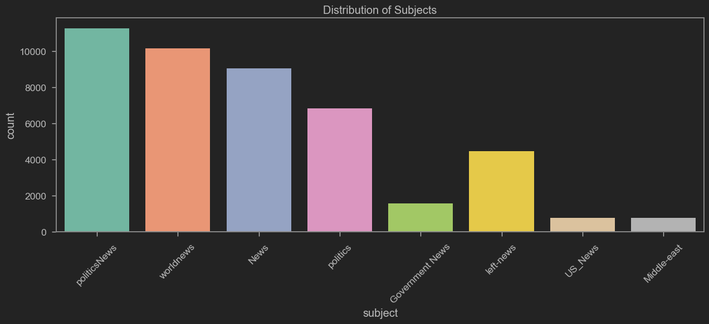
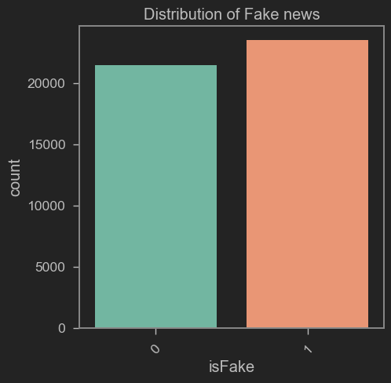
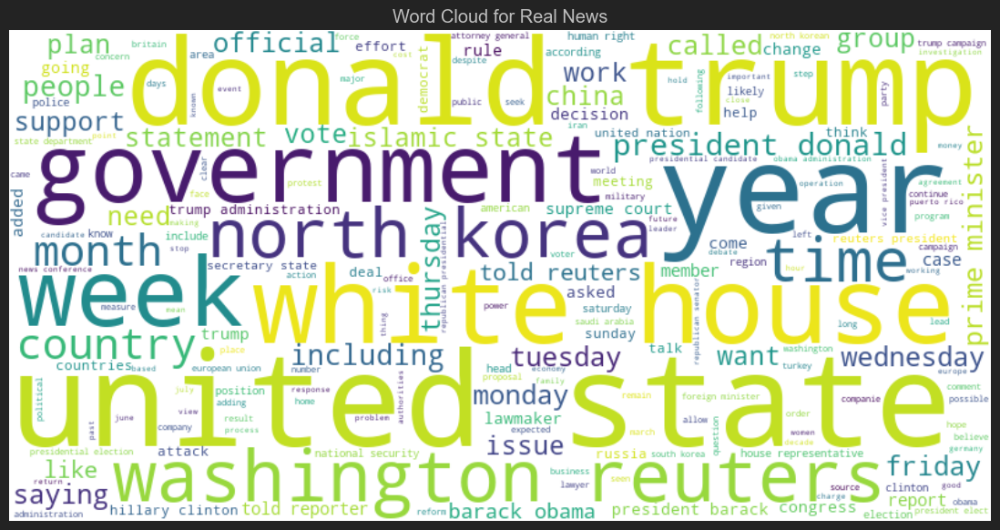
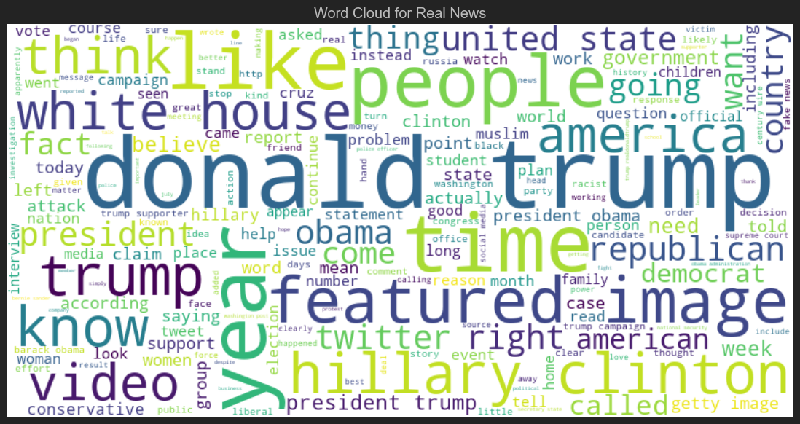
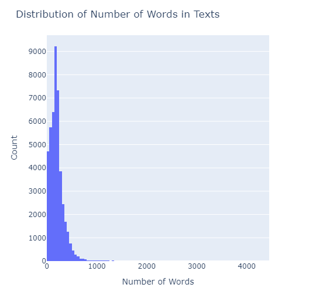
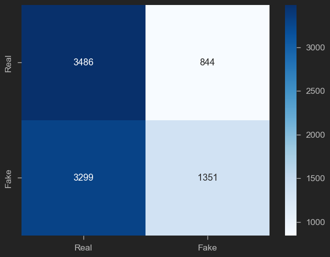

# Détection des Fake News

## 1. Importation et exploration des données
- Chargement de deux jeux de données : Fake.csv (fausses actualités) et True.csv (vraies actualités).
- Vérification de la présence de valeurs nulles et de l’utilisation mémoire.
- Visualisation des premières lignes de chaque dataset.

## 2. Feature Engineering
- Ajout d’une colonne `isFake` (0 pour vrai, 1 pour faux).
- Fusion des deux datasets en un seul DataFrame.
- Suppression de la colonne `date`.
- Création d’une colonne `original` combinant le titre et le texte.

## 3. Nettoyage des données
- Téléchargement et enrichissement de la liste des stopwords.
- Nettoyage du texte : suppression des stopwords et des mots courts, tokenisation.
- Création d’une colonne `clean` (liste de mots nettoyés) puis `clean_joined` (texte nettoyé sous forme de chaîne).
- Visualisation de quelques exemples avant/après nettoyage.

## 4. Visualisation
- Distribution des sujets (`subject`) et des classes (`isFake`).

- Nuages de mots pour les vraies et fausses actualités.
. Vraie

. Fausse

- Distribution du nombre de mots par texte.

## 5. Préparation des données pour le modèle
- Séparation en jeux d’entraînement et de test.
- Tokenisation et transformation des textes en séquences numériques.
- Padding des séquences pour uniformiser leur longueur.

## 6. Modélisation
- Construction d’un modèle de classification basé sur un réseau de neurones (Embedding + Bidirectional LSTM + Dense).
- Compilation du modèle avec la fonction de perte binaire et l’optimiseur Adam.

## 7. Évaluation des performances
- Prédiction sur le jeu de test.
- Calcul de l’accuracy.
- Affichage de la matrice de confusion.

### Résultats obtenus
- Le modèle atteint une certaine précision (accuracy) sur le jeu de test (voir cellule correspondante pour la valeur exacte).
- La matrice de confusion permet d’évaluer la capacité du modèle à distinguer les vraies et fausses actualités.

Ce notebook présente donc l’ensemble du pipeline de détection de fake news, de l’exploration à l’évaluation du modèle.
